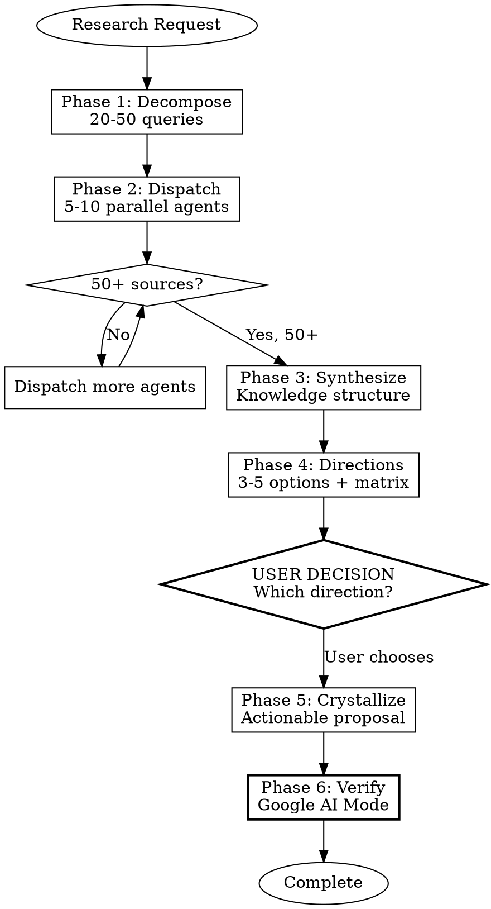

# Deep Research Discovery

## Prerequisites

> **Required dependencies:**
>
> **1. Superpowers plugin** (includes brainstorming, parallel agents, writing-plans):
> ```
> /plugin marketplace add superpowers-marketplace/superpowers
> /plugin install superpowers@superpowers-marketplace
> ```
> GitHub: https://github.com/obra/superpowers
> *One install → all superpowers skills included*
>
> **2. Google AI Mode skill** (for claim verification):
> ```bash
> git clone https://github.com/PleasePrompto/google-ai-mode-skill.git ~/.claude/skills/google-ai-mode
> ```
> GitHub: https://github.com/PleasePrompto/google-ai-mode-skill

## Recommended Workflow

**Always invoke `superpowers:brainstorming` BEFORE this skill.**

```
1. /superpowers:brainstorming  →  Scope the research question
2. /deep-research-discovery    →  Gather 50+ sources + verify claims (this skill)
3. /superpowers:writing-plans  →  Create execution plan (optional)
```

**This skill now includes automatic claim verification using Google AI Mode in Phase 6.**

**Why brainstorm first?**
- Clarifies what you actually need to research
- Prevents wasted effort gathering sources for the wrong question
- Identifies constraints, assumptions, and success criteria
- Narrows scope before committing to comprehensive gathering

**Do NOT skip brainstorming** thinking "I know what I want to research." The brainstorming phase often reveals:
- Hidden assumptions worth questioning
- Adjacent questions worth including
- Scope creep to avoid
- Success criteria to validate against

## Overview

Comprehensive research requiring **50+ sources minimum** through systematic parallel gathering, then narrowing to actionable directions.

**Core principle:** Breadth before depth. Gather comprehensively, then narrow systematically.

**Announce:** "Using deep-research-discovery to comprehensively explore [topic]."

## When to Use

- Starting research in a new domain
- Literature survey / state-of-the-art review
- Strategic decisions requiring comprehensive information
- Understanding landscape before committing to direction

**Don't use for:** Quick lookups, single-source answers, implementation tasks

## The Iron Law

```
NO RESEARCH COMPLETE WITHOUT 50+ SOURCES
```

**No exceptions:**
- Not for "simple topics"
- Not for "I found good sources already"
- Not for "time pressure"
- Not for "the user seems satisfied"

If you haven't gathered 50+ sources, you haven't done comprehensive research.

## Red Flags - STOP If You Think These

| Thought | Reality |
|---------|---------|
| "I have enough sources" | Count them. Is it 50+? No? Keep going. |
| "These 10 sources are high quality" | Quality AND quantity. 50+ minimum. |
| "Time to synthesize" | Did you dispatch parallel agents? Did you hit 50+? |
| "The user wants it fast" | Fast ≠ shallow. Parallel agents ARE fast. |
| "I already know this domain" | Training data ≠ current state. Research anyway. |
| "More sources won't add value" | You can't know this without gathering them first. |
| "I'll search sequentially first" | NO. Dispatch all agents in parallel. Single message. |
| "Let me do a quick search first" | Decompose queries BEFORE any searching. |
| "The topic is narrow" | Narrow topics still have 50+ relevant sources. Find them. |
| "I found what the user needs" | You don't know what you're missing. Hit 50+. |

## Process Flow



## Phase 1: Query Decomposition (20-50 queries)

Generate diverse queries BEFORE searching. Output the full list.

**Perspectives:** Academic, practitioner, critic, beginner, adjacent expert, skeptic

**Categories (3-5 queries each):**
- Foundational: "What is [X]", "[X] overview", "[X] fundamentals"
- State-of-the-art: "[X] 2024 2025", "latest [X] research", "recent advances"
- Methods: "[X] techniques", "how to [X]", "[X] algorithms"
- Comparisons: "[X] vs [Y]", "[X] alternatives", "best [X] approach"
- Problems: "[X] challenges", "[X] limitations", "[X] failures"
- Applications: "[X] use cases", "[X] real world", "[X] production"
- Tools: "[X] frameworks", "[X] libraries", "[X] benchmarks"
- Key players: "[X] companies", "[X] researchers", "[X] labs"

**Output format:**
```
## Query Decomposition (N queries)

### Foundational (N)
1. query
2. query
...

### State-of-the-art (N)
...

[Continue all categories]

Total: [COUNT] queries
```

**Checkpoint:** Do not proceed until you have 20+ queries listed.

## Phase 2: Parallel Source Gathering (50+ sources)

### The Second Iron Law

```
ALL AGENTS DISPATCHED IN A SINGLE MESSAGE
```

**No exceptions:**
- Not "I'll dispatch one first to see"
- Not "sequential is more controlled"
- Not "I'll parallelize the next batch"

### How to Dispatch (MANDATORY)

Use the Task tool **5-10 times in ONE message**. Each agent searches different query clusters:

```
<message with multiple Task calls>
  Task 1: Queries 1-8 (Core methods)
  Task 2: Queries 9-14 (Sim-to-real)
  Task 3: Queries 15-22 (Multi-task & vision)
  Task 4: Queries 23-30 (Specific challenges)
  Task 5: Queries 31-40 (Efficiency & SOTA)
  Task 6: Queries 41-50 (Benchmarks & tools)
</message>
```

**Each subagent prompt:**
```
Research these queries comprehensively:
[query list]

For EACH query:
- Execute web search
- Gather 5-10 relevant sources per query
- Extract: URL, title, 2-3 sentence key findings
- Prioritize: recent (2024-2025), authoritative, technical
- Skip: paywalled, duplicates, marketing fluff

Return ALL sources in structured format with count.
Target: 15-25 sources from your query set.
```

### Parallelization Red Flags

| Thought | Reality |
|---------|---------|
| "I'll start with one agent" | NO. Dispatch ALL agents in ONE message. |
| "Sequential gives more control" | Parallel is faster AND more thorough. |
| "Let me see what the first agent finds" | You're stalling. Dispatch all now. |
| "I can parallelize later" | Later = never. Do it now. |

### After ALL Agents Return

1. Count total unique sources
2. If < 50: dispatch MORE parallel agents with refined queries
3. Deep-fetch top 30-50 most relevant for full content

**Source Tracking Table:**
```
| # | Source | Key Finding | Category |
|---|--------|-------------|----------|
| 1 | URL    | Finding     | Category |
...
| 50+ | ...  | ...         | ...      |
```

**Checkpoint:** Do not proceed to synthesis until source count >= 50.

## Phase 3: Content Synthesis

Build knowledge structure from 50+ sources:

```
## Domain: [X]

### Core Concepts
- Concept 1 [sources: #3, #15, #42]
- Concept 2 [sources: #7, #23]

### Current Methods (with tradeoffs)
| Method | Pros | Cons | Sources |
|--------|------|------|---------|

### Key Benchmarks & Metrics
- Benchmark 1: description [source]

### Open Challenges
- Challenge 1 [sources disagree: #12 vs #34]

### Recent Breakthroughs (2024-2025)
- Breakthrough [sources: #...]

### Key Players
- Labs: ...
- Companies: ...
- Researchers: ...

### Contradictions Found
- Topic: Source #X says A, Source #Y says B
```

## Phase 4: Direction Identification

Extract 3-5 actionable directions. Present as comparison matrix:

```
## Directions Comparison

| Direction | Feasibility | Novelty | Impact | Risk | Key Sources |
|-----------|-------------|---------|--------|------|-------------|
| A: [name] | High/Med/Low | H/M/L  | H/M/L  | H/M/L | #3, #15    |
| B: [name] | ...         | ...     | ...    | ...   | ...         |

### Direction A: [Name]
**Summary:** 1-2 sentences
**Evidence:** What sources support this
**Challenges:** What could go wrong
**Recommendation:** When to choose this

[Repeat for each direction]
```

**MANDATORY USER CHECKPOINT:**
```
Which direction would you like me to crystallize into an actionable proposal?
- A: [name]
- B: [name]
- C: [name]
Or should I explore a different angle?
```

**Do NOT proceed to Phase 5 without user response.**

## Phase 5: Actionable Crystallization

Structure the chosen direction:

```markdown
# [Direction Title]

## Problem Statement
What problem this solves, grounded in research findings

## Proposed Approach
Specific methodology based on evidence gathered

## Expected Outcomes
Quantitative where possible, citing benchmark sources

## Technical Requirements
What's needed to execute

## Risks & Mitigations
Based on challenges identified in research

## Concrete First Steps
1. Immediate action (this week)
2. Short-term milestone
3. Validation checkpoint

## Key References
[Numbered list of most relevant sources]
```

## Phase 6: Claim Verification (Google AI Mode)

**MANDATORY: Verify major claims before finalizing research.**

After crystallization, use the `google-ai-mode` skill to independently verify claims from your research. This phase has two tiers:

### Tier 1: Critical Claims (Automatic)

Automatically verify the **most critical claims** that the proposal depends on.

**Identify critical claims by asking:**
- Does the proposed direction depend on this claim?
- Is this a quantitative claim (percentages, benchmarks, metrics)?
- Does this claim contradict other sources?
- Would being wrong about this claim invalidate the proposal?

**Process:**
1. **Extract ALL claims** from the crystallized proposal
2. **Categorize by criticality:** Critical / Important / Supporting
3. **Auto-verify all Critical claims** (typically 5-15 claims)

### Tier 2: Extended Verification (User Choice)

After Tier 1, present remaining unverified claims and ask the user:

```
## Verification Checkpoint

### Tier 1 Complete: Critical Claims Verified
- Verified: X claims
- Confirmed: Y
- Partially confirmed: Z
- Contradicted: W

### Remaining Unverified Claims (N total)

**Important claims (not yet verified):**
1. [Claim] - Source: #N
2. [Claim] - Source: #N
...

**Supporting claims (lower priority):**
1. [Claim] - Source: #N
...

### Options:
- A: **Continue verification** - Verify Important claims (adds ~Y minutes)
- B: **Deep verification** - Verify ALL remaining claims (adds ~Z minutes)
- C: **Done** - Proceed with current verification (Critical claims only)
- D: **Select specific claims** - Choose which claims to verify

Which option would you like?
```

**Do NOT proceed without user response.**

### Execution

For each claim to verify, run:

```bash
cd ~/.claude/skills/google-ai-mode
python scripts/run.py search.py --query "[Claim verification query] 2026" --save --debug
```

### Verification Query Template

```
"[Specific claim] [domain] [year] (evidence, studies, benchmarks, contradictions). Verify accuracy and provide sources."
```

### Examples

| Claim to Verify | Verification Query |
|-----------------|-------------------|
| "D-PoSE achieves SOTA with 10x fewer params" | "D-PoSE hand pose estimation parameters SOTA 2025 (architecture, benchmark results, comparison). Verify performance claims." |
| "MEgoHand reduces wrist error by 86.9%" | "MEgoHand egocentric hand pose wrist error reduction 2025 (methodology, results, depth integration). Verify accuracy." |
| "Temporal consistency improves pose by 15.9%" | "TempCLR temporal hand pose improvement 2025 (benchmark, methodology, comparison). Verify claimed improvement." |

### Output Format

```markdown
## Claim Verification Report

### Critical Claims (Tier 1 - Auto-verified)

#### Claim 1: [Statement]
- **Criticality:** Critical
- **Original Source:** [#N from research]
- **Google AI Verification:** ✅ Confirmed / ⚠️ Partially confirmed / ❌ Contradicted
- **Evidence:** [Summary from Google AI with citations]
- **Discrepancy:** [If any]
- **Action:** [None / Update claim / Flag for user review]

#### Claim 2: [Statement]
...

### Important Claims (Tier 2 - User-requested)
[If user chose to continue verification]

### Summary
- Total claims in proposal: N
- Critical claims verified: X/X (100%)
- Important claims verified: Y/Z (user choice)
- Supporting claims verified: W/V (user choice)
- Confirmed: A
- Partially confirmed: B
- Contradicted: C
- Recommended updates: [List]
```

### Claim Categorization Guide

| Category | Definition | Verification |
|----------|------------|--------------|
| **Critical** | Proposal depends on it; if wrong, proposal fails | Always verify |
| **Important** | Strengthens proposal; affects confidence level | User choice |
| **Supporting** | Background context; nice-to-have accuracy | User choice |

### Red Flags

| Thought | Reality |
|---------|---------|
| "I trust my sources" | Independent verification catches errors and outdated info. |
| "This is overkill" | One wrong critical claim undermines entire research credibility. |
| "Google AI might be wrong" | Cross-reference both. If they disagree, investigate further. |
| "I'll verify later" | Verify critical claims NOW. User can choose to verify more. |
| "All claims are equally important" | No. Categorize by impact on the proposal. |

**Checkpoint:** Do not finalize research without:
1. All critical claims verified
2. User decision on extended verification

## Quick Reference

| Phase | Output | Minimum | Checkpoint |
|-------|--------|---------|------------|
| 1. Decompose | Query list | 20 queries | List complete |
| 2. Gather | Source table | **50 sources** | Count verified |
| 3. Synthesize | Knowledge structure | All categories | Structure complete |
| 4. Directions | Comparison matrix | 3-5 options | **User chooses** |
| 5. Crystallize | Proposal | All sections | Ready for verification |
| 6. Verify (Tier 1) | Critical claims report | **All critical claims** | Auto-verified |
| 6. Verify (Tier 2) | Extended verification | User choice | **User decides scope** |

## Common Mistakes

| Mistake | Fix |
|---------|-----|
| Stopping at 10-15 sources | Dispatch more parallel agents until 50+ |
| Skipping query decomposition | Write out all 20-50 queries BEFORE searching |
| Sequential agent dispatch | ALL Task calls in ONE message, not separate |
| Dispatching one agent first | Dispatch 5-10 agents simultaneously |
| No user checkpoint | MUST pause at Phase 4 for direction choice |
| Vague directions | Each direction needs evidence + tradeoffs |
| Rushing synthesis | Take time to find contradictions and gaps |
| Skipping source count | Explicitly count: "Sources gathered: N" |
| Ad-hoc searching | Follow the phases in order |

## Skill Integration

### Required Installations (2 total)

| Install | What You Get | GitHub |
|---------|--------------|--------|
| **superpowers plugin** | All superpowers skills (brainstorming, parallel-agents, writing-plans, etc.) | [obra/superpowers](https://github.com/obra/superpowers) |
| **google-ai-mode skill** | Claim verification via Google AI search | [PleasePrompto/google-ai-mode-skill](https://github.com/PleasePrompto/google-ai-mode-skill) |

### Skills Used From Superpowers Plugin

| Skill | When | Purpose |
|-------|------|---------|
| `superpowers:brainstorming` | BEFORE this skill | Scope the research question |
| `superpowers:dispatching-parallel-agents` | Phase 2 | Parallel agent dispatch |
| `superpowers:writing-plans` | After Phase 6 (optional) | Create execution plan |

**Note:** Install the superpowers plugin once → all skills above are automatically available.

See [Prerequisites](#prerequisites) for installation commands.

### Complete Workflow

```
┌─────────────────────────────────────────────────────────────────┐
│  STEP 0: superpowers:brainstorming (STRONGLY RECOMMENDED)       │
│  Scope the question, identify constraints, define success       │
└─────────────────────────────────────────────────────────────────┘
                              ↓
┌─────────────────────────────────────────────────────────────────┐
│  PHASES 1-5: deep-research-discovery (THIS SKILL)               │
│  Query decomposition → Parallel gathering → Synthesis →         │
│  Direction identification → Crystallization                     │
└─────────────────────────────────────────────────────────────────┘
                              ↓
┌─────────────────────────────────────────────────────────────────┐
│  PHASE 6: google-ai-mode (CLAIM VERIFICATION)                   │
│  Verify 5-10 key claims using Google AI search                  │
└─────────────────────────────────────────────────────────────────┘
                              ↓
┌─────────────────────────────────────────────────────────────────┐
│  OPTIONAL: superpowers:writing-plans                            │
│  Convert verified proposal into execution plan                  │
└─────────────────────────────────────────────────────────────────┘
```
