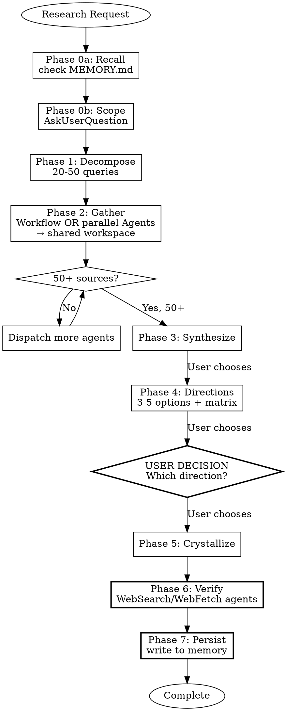

# Deep Research Discovery

## What changed in v2.0.0 (native harness)

This skill used to depend on the **superpowers** plugin (for parallel-agent dispatch) and the
**google-ai-mode** Python skill (for claim verification). Both dependencies are **removed**. The skill
now runs entirely on first-party Claude Code capabilities:

| Old dependency | Replaced by (native harness) |
|----------------|------------------------------|
| `superpowers:brainstorming` | `AskUserQuestion` for scoping (Phase 0) |
| `superpowers:dispatching-parallel-agents` + `Task` tool | The `Agent` tool (parallel subagents) or the `Workflow` tool (deterministic fan-out) |
| `google-ai-mode` Python script (Google search + CAPTCHA) | Built-in `WebSearch` + `WebFetch` verifier agents (Phase 6) |
| Ad-hoc notes lost at session end | **File-based memory** — report persisted for recall in future sessions (Phase 7) |

This skill also actively uses three newer harness features described below: **dynamic workflows**,
**shared agent memory**, and **persistent memory**.

## Harness features this skill relies on

### 1. The `Agent` tool (parallel subagents)
Spawn subagents with `subagent_type`. The useful types here:
- `general-purpose` — runs WebSearch/WebFetch, gathers and summarizes sources. The workhorse for Phase 2 and Phase 6.
- `Explore` — fast read-only lookups (use only if research touches a local codebase).

**Parallel rule:** to run agents concurrently, put **multiple `Agent` calls in a single assistant
message**. Sequential calls do NOT parallelize. Each agent's final message is returned to the
orchestrator as the tool result — it is not shown to the user, so instruct agents to return raw
structured data (source tables), not prose for a human.

### 2. Dynamic workflows (the `Workflow` tool) — PREFERRED for the full run
For a comprehensive run, prefer a single `Workflow` over hand-dispatched agents. A workflow script
gives deterministic control flow — fan-out, loop-until-count, and a verify pipeline — in one
orchestrated unit, and reports live progress. Use `pipeline()` so each gathered cluster flows into
dedup/verify without waiting for the slowest sibling, and `parallel()` only when you genuinely need
all results at once (e.g. dedup across the full source set). See "Phase 2 — Workflow mode" below.

> **Opt-in:** the `Workflow` tool requires explicit user opt-in (e.g. the user said "use a workflow",
> "ultracode", or invoked this skill knowing it orchestrates agents). Invoking this skill counts as
> asking for multi-agent research, so a workflow IS appropriate here. If you are unsure the user wants
> the scale, fall back to hand-dispatched `Agent` calls (Phase 2 — Agent mode) instead.

### 3. Shared agent memory (a shared research workspace)
Subagents do not see each other's context. To make them collaborate, give every dispatched agent a
**shared workspace directory** and have each one APPEND its findings there. This is the skill's
"shared agent memory":

```
.deep-research/<topic-slug>/
├── sources/        # each agent writes sources-<agent>.md (URL | title | finding | category)
├── synthesis.md    # orchestrator's merged knowledge structure
└── claims.md       # extracted claims + verification verdicts
```

Tell each gathering agent: *"Append every source you find to
`.deep-research/<slug>/sources/sources-<your-cluster>.md` as a markdown table row before returning."*
The orchestrator then reads the whole `sources/` directory to dedup and count — nothing is lost if an
agent's return message is truncated, and a re-run can resume from what is already on disk.

Also pass relevant **recalled memories** (see Phase 7) into agent prompts so agents share prior-session
context, not just this run's.

### 4. Persistent memory (Phase 7)
At the end, write the finished report (or a pointer to it) into the project memory directory and add a
one-line index entry to `MEMORY.md`. Future sessions recall it instead of re-researching. Before
starting a new run, check `MEMORY.md` for prior research on the same topic and build on it.

## Recommended Workflow

```
1. Phase 0: Scope         → AskUserQuestion (clarify the question first)
2. Phases 1-5: Research   → decompose → gather (50+) → synthesize → directions → crystallize
3. Phase 6: Verify        → WebSearch/WebFetch adversarial verification of critical claims
4. Phase 7: Persist       → save report to memory for future recall
```

**Do NOT skip scoping** thinking "I know what I want to research." Scoping reveals hidden assumptions,
adjacent questions worth including, scope creep to avoid, and success criteria to validate against.

## Overview

Comprehensive research requiring **50+ sources minimum** through systematic parallel gathering, then
narrowing to verified, actionable directions.

**Core principle:** Breadth before depth. Gather comprehensively, verify claims, then narrow systematically.

**Announce:** "Using deep-research-discovery to comprehensively explore [topic]."

## When to Use

- Starting research in a new domain
- Literature survey / state-of-the-art review
- Strategic decisions requiring comprehensive information
- Understanding landscape before committing to direction

**Don't use for:** Quick lookups, single-source answers, implementation tasks.

## The Iron Laws

```
┏━━━━━━━━━━━━━━━━━━━━━━━━━━━━━━━━━━━━━━━━━━━┓
┃  NO RESEARCH COMPLETE WITHOUT 50+ SOURCES  ┃
┗━━━━━━━━━━━━━━━━━━━━━━━━━━━━━━━━━━━━━━━━━━━┛
┏━━━━━━━━━━━━━━━━━━━━━━━━━━━━━━━━━━━━━━━━━━━┓
┃  NO CRITICAL CLAIM ACCEPTED WITHOUT VERIFY ┃
┗━━━━━━━━━━━━━━━━━━━━━━━━━━━━━━━━━━━━━━━━━━━┛
```

**No exceptions** to the source count: not for "simple topics", not for "I found good sources already",
not for "time pressure", not for "the user seems satisfied". If you haven't gathered 50+ sources, you
haven't done comprehensive research.

## Red Flags - STOP If You Think These

| Thought | Reality |
|---------|---------|
| "I have enough sources" | Count them. Is it 50+? No? Keep going. |
| "These 10 sources are high quality" | Quality AND quantity. 50+ minimum. |
| "Time to synthesize" | Did you dispatch parallel agents? Did you hit 50+? |
| "The user wants it fast" | Fast ≠ shallow. Parallel agents/workflows ARE fast. |
| "I already know this domain" | Training data ≠ current state. Research anyway. |
| "I'll search sequentially first" | NO. Dispatch all agents in ONE message, or use a Workflow. |
| "Let me do a quick search first" | Decompose queries BEFORE any searching. |
| "I'll trust my sources for the claims" | Critical claims get independent WebSearch verification. |
| "I'll save the report later" | Persist to memory in Phase 7 — later = never. |

## Process Flow


```dot
digraph research_flow {
    rankdir=TB; node [shape=box];
    start    [label="Research Request" shape=ellipse];
    recall   [label="Phase 0a: Recall\ncheck MEMORY.md"];
    scope    [label="Phase 0b: Scope\nAskUserQuestion"];
    decompose[label="Phase 1: Decompose\n20-50 queries"];
    dispatch [label="Phase 2: Gather\nWorkflow OR parallel Agents\n→ shared workspace"];
    count    [label="50+ sources?" shape=diamond];
    more     [label="Dispatch more agents"];
    synth    [label="Phase 3: Synthesize"];
    dirs     [label="Phase 4: Directions\n3-5 options + matrix"];
    pick     [label="USER DECISION\nWhich direction?" shape=diamond style=bold];
    cryst    [label="Phase 5: Crystallize"];
    verify   [label="Phase 6: Verify\nWebSearch/WebFetch agents" style=bold];
    persist  [label="Phase 7: Persist\nwrite to memory" style=bold];
    done     [label="Complete" shape=ellipse];

    start -> recall -> scope -> decompose -> dispatch -> count;
    count -> more [label="No"]; more -> count;
    count -> synth [label="Yes, 50+"];
    synth -> dirs -> pick -> cryst [label="User chooses"];
    cryst -> verify -> persist -> done;
}
```

## Phase 0: Recall + Scope

**0a. Recall.** Read the project `MEMORY.md` index. If a prior research report on this topic (or an
adjacent one) exists, load it and tell the user — build on it instead of starting from zero.

**0b. Scope.** Unless the question is already specific, use `AskUserQuestion` to narrow it before
committing to a full gather. Good scoping questions cover: depth/breadth, time horizon (latest only vs.
historical), domain constraints (region, framework, license), and what decision the research will
inform. Weave the answers into Phase 1 queries.

## Phase 1: Query Decomposition (20-50 queries)

Generate diverse queries BEFORE searching. Output the full list.

**Perspectives:** Academic, practitioner, critic, beginner, adjacent expert, skeptic.

**Categories (3-5 queries each):**
- Foundational: "What is [X]", "[X] overview", "[X] fundamentals"
- State-of-the-art: "[X] 2025 2026", "latest [X] research", "recent advances"
- Methods: "[X] techniques", "how to [X]", "[X] algorithms"
- Comparisons: "[X] vs [Y]", "[X] alternatives", "best [X] approach"
- Problems: "[X] challenges", "[X] limitations", "[X] failures"
- Applications: "[X] use cases", "[X] real world", "[X] production"
- Tools: "[X] frameworks", "[X] libraries", "[X] benchmarks"
- Key players: "[X] companies", "[X] researchers", "[X] labs"

**Output format:**
```
## Query Decomposition (N queries)
### Foundational (N)
1. query …
### State-of-the-art (N)
…
Total: [COUNT] queries
```

**Checkpoint:** Do not proceed until you have 20+ queries listed.

## Phase 2: Parallel Source Gathering (50+ sources)

### The Second Iron Law
```
ALL AGENTS DISPATCHED CONCURRENTLY — never one-at-a-time
```
Concurrency comes from either (a) multiple `Agent` calls in ONE message, or (b) a `Workflow` that
fans out internally. Both are valid; pick one mode and commit.

First create the shared workspace:
```bash
mkdir -p .deep-research/<topic-slug>/sources
```

### Phase 2 — Workflow mode (preferred for full runs)

Author a `Workflow` that fans out one agent per query cluster, has each agent write to the shared
workspace, then pipelines gathered clusters straight into dedup. Sketch:

```js
export const meta = {
  name: 'deep-research-gather',
  description: 'Fan out research agents over query clusters, gather 50+ sources, dedup',
  phases: [{ title: 'Gather' }, { title: 'Dedup' }],
}
const CLUSTERS = args.clusters // [{label, queries:[...]}] passed in via Workflow args
const SOURCE_SCHEMA = {
  type: 'object',
  properties: {
    sources: { type: 'array', items: {
      type: 'object',
      properties: { url:{type:'string'}, title:{type:'string'}, finding:{type:'string'}, category:{type:'string'} },
      required: ['url','title','finding','category'],
    }},
  },
  required: ['sources'],
}
const gathered = await parallel(CLUSTERS.map((c, i) => () =>
  agent(
    `Research these queries with WebSearch, then WebFetch the most promising results:\n` +
    c.queries.map((q,n)=>`${n+1}. ${q}`).join('\n') +
    `\n\nFor EACH query gather 5-10 sources. Prioritize recent (2025-2026), authoritative, technical. ` +
    `Skip paywalled, duplicate, marketing pages. Append every source as a markdown table row to ` +
    `.deep-research/${args.slug}/sources/sources-${i}.md, THEN return them. Target 15-25 sources.`,
    { label: `gather:${c.label}`, phase: 'Gather', schema: SOURCE_SCHEMA }
  )
))
const all = gathered.filter(Boolean).flatMap(r => r.sources)
const deduped = Array.from(new Map(all.map(s => [s.url, s])).values()) // barrier-free dedup in plain JS
return { count: deduped.length, sources: deduped }
```

If `count < 50`, run the workflow again with additional refined clusters (loop until ≥50). The skill's
50-source law is enforced by you, the orchestrator, not by the workflow.

### Phase 2 — Agent mode (fallback, no workflow)

Use the `Agent` tool 5-10 times in **one message**, each `general-purpose`, each owning a query cluster.
Each agent prompt:

```
Research these queries comprehensively using WebSearch and WebFetch:
[query list]

For EACH query:
- Run WebSearch, then WebFetch the most promising 5-10 results for full content
- Extract: URL, title, 2-3 sentence key finding, category
- Prioritize: recent (2025-2026), authoritative, technical
- Skip: paywalled, duplicates, marketing fluff
- APPEND each source as a table row to .deep-research/<slug>/sources/sources-<cluster>.md

Return ALL sources as a structured table with a count. Target: 15-25 sources.
```

### After ALL agents/the workflow return
1. Read the whole `.deep-research/<slug>/sources/` directory and count total **unique** sources (dedup by URL).
2. If < 50: dispatch MORE parallel agents / re-run the workflow with refined queries.
3. Deep-fetch (WebFetch) the top 30-50 most relevant for full content.

**Source Tracking Table** (merge into `synthesis.md`):
```
| # | Source (URL) | Key Finding | Category |
|---|--------------|-------------|----------|
```

**Checkpoint:** Do not proceed to synthesis until unique source count >= 50. State it explicitly:
"Sources gathered: N".

## Phase 3: Content Synthesis

Build the knowledge structure from 50+ sources and write it to `.deep-research/<slug>/synthesis.md`:

```
## Domain: [X]
### Core Concepts        — concept [sources: #3, #15, #42]
### Current Methods      — table: Method | Pros | Cons | Sources
### Key Benchmarks & Metrics
### Open Challenges       — note where sources disagree (#12 vs #34)
### Recent Breakthroughs (2025-2026)
### Key Players           — labs / companies / researchers
### Contradictions Found  — Source #X says A, Source #Y says B
```

## Phase 4: Direction Identification

Extract 3-5 actionable directions as a comparison matrix:

```
| Direction | Feasibility | Novelty | Impact | Risk | Key Sources |
|-----------|-------------|---------|--------|------|-------------|
```

Then, for each: **Summary**, **Evidence**, **Challenges**, **Recommendation**.

**MANDATORY USER CHECKPOINT** — use `AskUserQuestion` to present the directions as selectable options
(one option per direction, plus an "explore a different angle" path). **Do NOT proceed to Phase 5
without the user's choice.**

## Phase 5: Actionable Crystallization

Structure the chosen direction:

```markdown
# [Direction Title]
## Problem Statement       — grounded in research findings
## Proposed Approach       — specific methodology from evidence
## Expected Outcomes       — quantitative where possible, cite benchmark sources
## Technical Requirements
## Risks & Mitigations      — based on challenges identified in research
## Concrete First Steps     — this week / short-term milestone / validation checkpoint
## Key References           — numbered list of most relevant sources
```

## Phase 6: Claim Verification (native WebSearch/WebFetch)

**MANDATORY: independently verify critical claims before finalizing.** This replaces the old
google-ai-mode dependency with first-party search — no Python, no CAPTCHA.

1. **Extract ALL claims** from the crystallized proposal and write them to `.deep-research/<slug>/claims.md`.
2. **Categorize by criticality:**
   | Category | Definition | Verification |
   |----------|------------|--------------|
   | **Critical** | Proposal depends on it; if wrong, proposal fails | Always verify |
   | **Important** | Strengthens proposal; affects confidence | User choice (Tier 2) |
   | **Supporting** | Background context | User choice (Tier 2) |

### Tier 1: Critical claims (automatic, adversarial)
For each critical claim, dispatch a **verifier agent** (`general-purpose`) — ideally several per claim,
in parallel, each prompted to **try to REFUTE** the claim with independent sources. A claim survives
only if a majority of verifiers fail to refute it and find corroborating evidence. Verifier prompt:

```
Independently fact-check this claim using WebSearch + WebFetch. Try to REFUTE it.
CLAIM: "[claim]"
Find 2-4 independent sources (NOT [original source]). Prefer 2025-2026, authoritative.
Return: verdict (Confirmed / Partially confirmed / Contradicted), the evidence with URLs,
and any numeric discrepancy vs. the original claim.
```

In a `Workflow`, pipeline this: each crystallized claim flows into N parallel refuters and a verdict
schema, so verification of claim A runs while claim B is still being extracted.

### Tier 2: Extended verification (user choice)
After Tier 1, present remaining Important/Supporting claims and use `AskUserQuestion`:
- **Continue** — verify Important claims
- **Deep** — verify ALL remaining claims
- **Done** — proceed with critical-only verification
- **Select** — choose specific claims

### Verification report
```markdown
## Claim Verification Report
### Critical Claims (Tier 1 — auto-verified, adversarial)
#### Claim 1: [statement]
- Criticality: Critical | Original source: #N
- Verdict: ✅ Confirmed / ⚠️ Partially confirmed / ❌ Contradicted
- Evidence: [summary with independent URLs]
- Discrepancy / Action: [update claim / flag for user / none]
### Summary
- Total claims: N | Critical verified: X/X | Confirmed: A | Partial: B | Contradicted: C
- Recommended updates: […]
```

**Checkpoint:** Do not finalize without (1) all critical claims verified and (2) a user decision on Tier 2.

## Phase 7: Persist to Memory

Make the research durable so future sessions recall it instead of redoing it.

1. **Write the full report** to the shared workspace as `.deep-research/<slug>/REPORT.md`
   (synthesis + chosen direction + verification report + source table). Tell the user the path.
2. **Save a memory file** in the project memory directory
   (`<project>/memory/research-<slug>.md`) with frontmatter:
   ```markdown
   ---
   name: research-<slug>
   description: Deep-research report on <topic> — <one-line takeaway> (as of <date>)
   metadata:
     type: project
   ---
   <2-4 sentence summary of the chosen direction and its verification status.>
   Full report: .deep-research/<slug>/REPORT.md. Sources: N. Critical claims verified: X/X.
   ```
3. **Add a one-line pointer to `MEMORY.md`:**
   `- [Research: <topic>](memory/research-<slug>.md) — <hook>`

Before any new run, Phase 0a reads this index — so research compounds across sessions.

## Quick Reference

| Phase | Output | Minimum | Checkpoint | Harness feature |
|-------|--------|---------|------------|-----------------|
| 0. Recall + Scope | Prior reports + scope | — | Scope agreed | `MEMORY.md`, `AskUserQuestion` |
| 1. Decompose | Query list | 20 queries | List complete | — |
| 2. Gather | Source table | **50 sources** | Count verified | `Workflow` / `Agent`, shared workspace |
| 3. Synthesize | Knowledge structure | All categories | Structure complete | — |
| 4. Directions | Comparison matrix | 3-5 options | **User chooses** | `AskUserQuestion` |
| 5. Crystallize | Proposal | All sections | Ready to verify | — |
| 6. Verify | Claim report | All critical | **User decides Tier 2** | `WebSearch`/`WebFetch` agents |
| 7. Persist | Memory entry | Report + index | Saved | File-based memory |

## Common Mistakes

| Mistake | Fix |
|---------|-----|
| Stopping at 10-15 sources | Dispatch more parallel agents / re-run workflow until 50+ |
| Skipping query decomposition | Write out all 20-50 queries BEFORE searching |
| Sequential agent dispatch | ALL Agent calls in ONE message, or use a Workflow |
| Agents losing each other's work | Use the shared `.deep-research/<slug>/sources/` workspace |
| No user checkpoint | MUST pause at Phase 4 (and Tier 2) with AskUserQuestion |
| Trusting claims unverified | Adversarial WebSearch verification of all critical claims |
| Research evaporates at session end | Persist to memory in Phase 7 |
| Vague directions | Each direction needs evidence + tradeoffs |
| Skipping source count | Explicitly state "Sources gathered: N" |

## Optional integrations (no longer required)

These were hard dependencies in v1 and are now **optional**:
- **superpowers plugin** — if installed, `superpowers:writing-plans` can turn a verified proposal into
  an execution plan. The native `Plan` agent type covers the same need.
- **google-ai-mode skill** — only needed if you specifically want Google AI Mode search; native
  `WebSearch`/`WebFetch` is the default and needs no setup.
